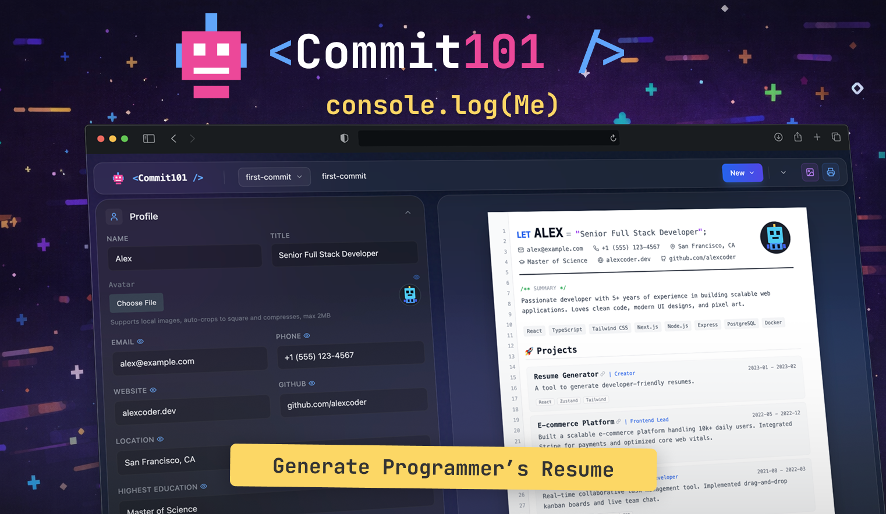

> A Minimalist & Geeky Resume Generator for Developers.
> [Try it now](https://tamingmonster.github.io/commit101/)

## ✨ Features

- **👀 Live Preview**: Edit on the left, render on the right in real-time.
- **🎨 Geek Style**: Minimalist, code-inspired design focused on readability.
- **🔒 Local-First**: All data is stored locally (or via JSON import/export), ensuring privacy with no server-side storage.
- **📄 PDF Export**: High-quality PDF export supporting A4 standard.
- **💾 Data Management**: Export JSON for backup and import for restoration, making version control easy.
- **⚛️ Modern Tech Stack**: Built with React + TypeScript + Vite for a smooth interactive experience.

## 🛠️ Tech Stack

- **Core**: [React](https://react.dev/), [TypeScript](https://www.typescriptlang.org/), [Vite](https://vitejs.dev/)
- **State Management**: [Zustand](https://github.com/pmndrs/zustand)
- **Styling**: [Tailwind CSS](https://tailwindcss.com/)
- **Animation**: [Framer Motion](https://www.framer.com/motion/)
- **Icons**: [Lucide React](https://lucide.dev/)
- **IMAGE/PDF Generation**: [jsPDF](https://github.com/parallax/jsPDF), [snap-dom](https://github.com/zumerlab/snapdom)

## 🚀 Getting Started

### Prerequisites

Ensure your local environment has [Node.js](https://nodejs.org/) installed (v24+ recommended).

### Installation

1. **Install dependencies**

   ```bash
   npm install
   ```

2. **Start development server**

   ```bash
   npm run dev
   ```

   Open your browser and visit `http://localhost:5173` to see the application.

### Build

```bash
npm run build
```

The build artifacts will be located in the `dist` directory.

## 📄 License

Distributed under the [MIT License](LICENSE).


